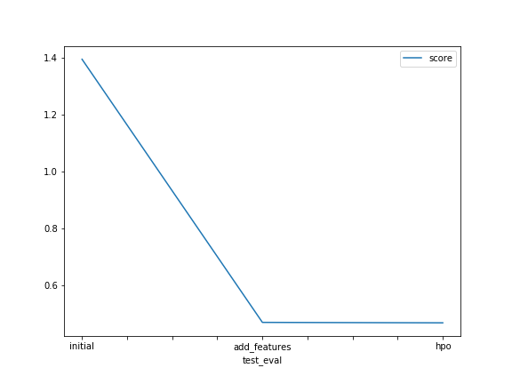

# Report: Predict Bike Sharing Demand with AutoGluon Solution
#### Aitor Magán

## Initial Training
### What did you realize when you tried to submit your predictions? What changes were needed to the output of the predictor to submit your results?
Predictions cannot be submitted to Kaggle with values lower than zero. It makes sense as the number of clientes will 
always be above zero. So, in order to submit the predictions, all values below zero must be transformed into zero as
stated in the instructions. 

### What was the top ranked model that performed?
I did the project in two different days. The first day I completed the basic part:

1. Initial Training
2. Training with extra features
3. Training with extra features + Basic Hyperparameters Optimization

The third model was the one with the best performance.

On a different day, as can be seen in the notebook, I tried additional hyperparameters optimization plus adding new
features, but I was unable to obtain a model with better performance than the one I obtained on the first day.

## Exploratory data analysis and feature creation
### What did the exploratory analysis find and how did you add additional features?
I added new features according to the instructions you provided in the notebook:

1. Split datetime into year, month, day and hour
2. Set `sesaon` and `weather` as category

Additionally, I created new features based on the instructions provided on the submit page:

* `time_slot` category to differenciate `morning`, `lunch` and `evening`
* `wind_type` to categorize `calm`, `breeze`, `windy` and `very windy` situations
* `temp_type` to categorize `cold`, `mild` and `hot` situations

### How much better did your model preform after adding additional features and why do you think that is?
Spliting date and setting `season` and `weather` allow me to improve by Kaggle score from `1.39` to `0.47`.

The reason can be than the more significant features we provide, the best the model perfoms. 

## Hyper parameter tuning
### How much better did your model preform after trying different hyper parameters?
I don't understand too much how hyperparameters can be modified as it seems like black magic to me. I tried to train
the model with `hyperparameter_tune_kwargs='auto'` and Kaggle score improved to `0.4684` which is not much better than
the result I obtained just with new features. 

On a different day, I also tried to increase the traning time, but I don't know why I obtained a much worse score. 
Specifically, I got `0.56132`

### If you were given more time with this dataset, where do you think you would spend more time?
Adding extra features. 

### Create a table with the models you ran, the hyperparameters modified, and the kaggle score.
N/A

### Create a line plot showing the top model score for the three (or more) training runs during the project.

TODO: Replace the image below with your own.

### Create a line plot showing the top kaggle score for the three (or more) prediction submissions during the project.

TODO: Replace the image below with your own.

## Summary
From this leason, I have been able to understad how to create models with AutoGlun, which can be very useful when 
trying to apply ML at work. I also learned that adding new features and typing the ones you already have, is very 
important to obtain better performance.

On my second day, I started with the basic `train` set and I created a first models. With this model, I got a score of
`0.56132` on Kaggle. By adding new features such as `wind_type`, `temp_type` and `time_slot` I was able to improve this
score to `0.479`.

However, I was unable to obtain a significan better performance by modifying the hyperparameters. 
