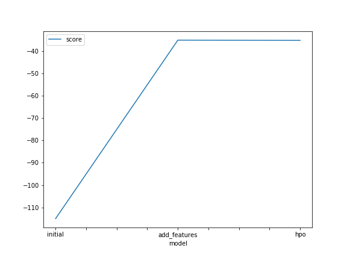

# Report: Predict Bike Sharing Demand with AutoGluon Solution
#### Aitor Magán

## Initial Training
### What did you realize when you tried to submit your predictions? What changes were needed to the output of the predictor to submit your results?
Predictions cannot be submitted to Kaggle with values lower than zero. It makes sense as the number of clientes will 
always be above zero. So, in order to submit the predictions, all values below zero must be transformed into zero as
stated in the instructions. 

### What was the top ranked model that performed?
I did the project in two different days. The first day I completed the basic part:

1. Initial Training
2. Training with extra features
3. Training with extra features + Basic Hyperparameters Optimization

The third model was the one with the best performance.

On a different day, as can be seen in the notebook, I tried to include extra features but the results weren't much 
better than the ones I obtained the first day.

## Exploratory data analysis and feature creation
### What did the exploratory analysis find and how did you add additional features?
I added new features according to the instructions you provided in the notebook:

1. Split datetime into year, month, day and hour
2. Set `sesaon` and `weather` as category

Additionally, I created new features based on the instructions provided on the submit page:

* `time_slot` category to differenciate `morning`, `lunch` and `evening`
* `wind_type` to categorize `calm`, `breeze`, `windy` and `very windy` situations
* `temp_type` to categorize `cold`, `mild` and `hot` situations

### How much better did your model preform after adding additional features and why do you think that is?
Spliting date and setting `season` and `weather` allow me to improve by Kaggle score from `1.39` to `0.47`.

The reason can be than the more significant features we provide, the best the model perfoms. 

## Hyper parameter tuning

> Note: Hyperparameters optimization has been completed in a separated notebook (`hyperparameters.ipynb`) as the main 
one is too big and my machine was unable to handle it.

### How much better did your model preform after trying different hyper parameters?
I don't understand too much how hyperparameters can be modified as it seems like black magic to me. I tried different 
values for `num_bag_folds` and `num_stack_levels` as stated in the table below, but the improvement is not very 
significant as scored increased from `0.4780` to `0.46811`.

### If you were given more time with this dataset, where do you think you would spend more time?
Adding extra features and trying different values for the hyperparameters. 

### Create a table with the models you ran, the hyperparameters modified, and the kaggle score.
|model|time|num_bag_folds|num_stack_levels|score|
|--|--|--|--|--|
|add_features|600|5|1|0.46811|
|add_features|600|10|3|0.48236|
|add_features|600|8|2|0.47674|
|extra_features|600|5|1|0.46747|

### Create a line plot showing the top model score for the three (or more) training runs during the project.

### Create a line plot showing the top kaggle score for the three (or more) prediction submissions during the project.

## Summary
From this leason, I have been able to understad how to create models with AutoGluon, which can be very useful when 
trying to apply ML at work. I also learned that adding new features from the existing data can be very helpful for 
obtaining a significant performance improvement. 

However, I was unable to obtain a significan better performance by modifying the hyperparameters. 
